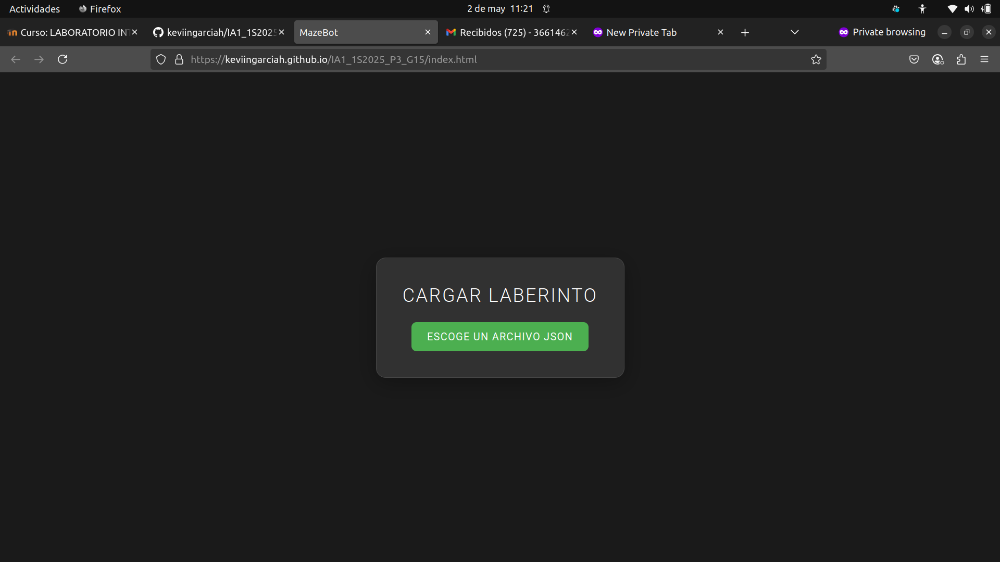
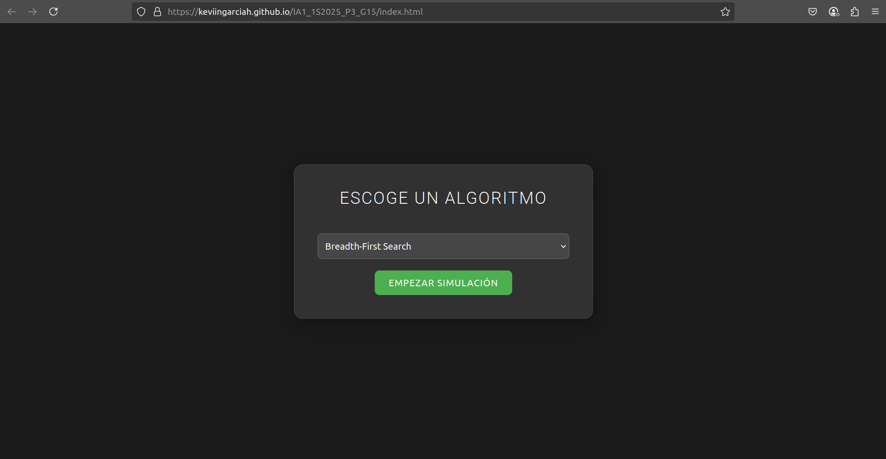
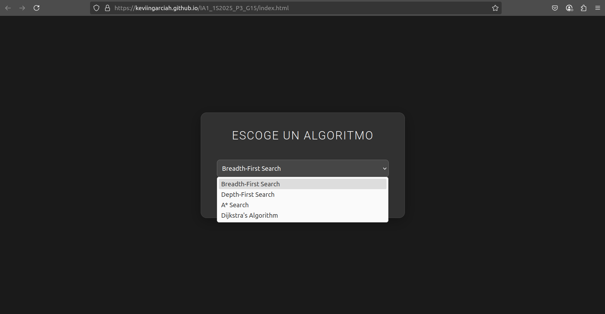
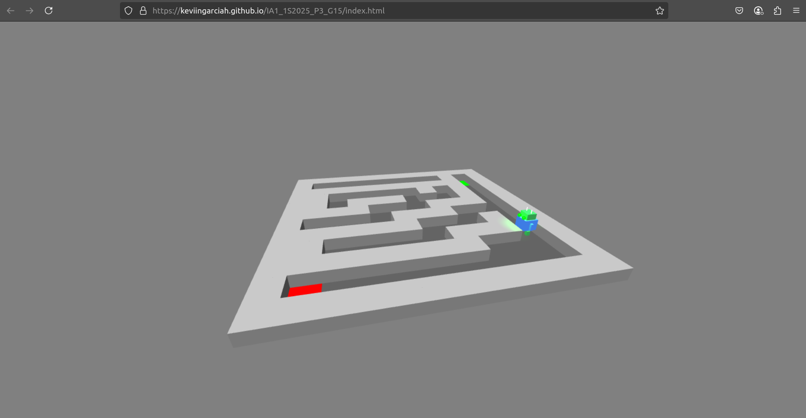
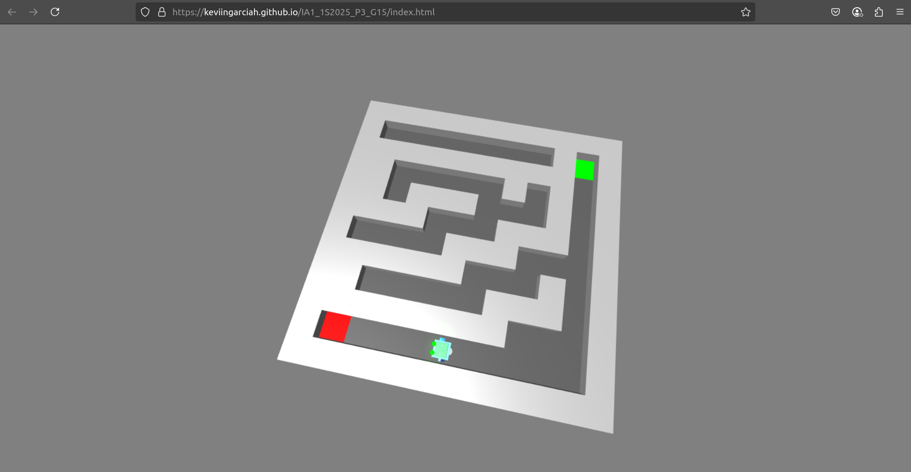
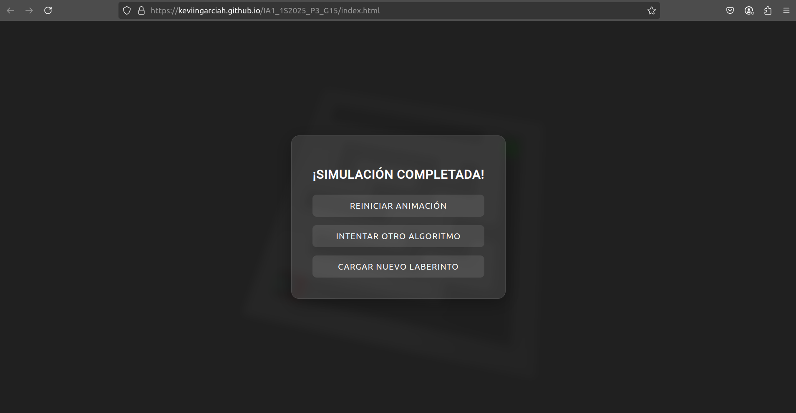

# Manual de usuario

## MazeBot

MazeBot es un simulador tridimensional de resolución de laberintos desarrollado por losestudiantes del curso de Inteligencia Artificial 1 de la Universidad de San Carlos de Guatemala. Su propósito es introducir a los estudiantes en la simulación de entornos inteligentes, combinando elementos de lógica, visualización tridimensional y algoritmos de búsqueda de caminos.

MazeBot permite diseñar laberintos de manera dinámica mediante archivos JSON configurables, e implementa un robot virtual que analiza su entorno y determina la mejor ruta desde un punto de inicio hasta una meta. El proyecto aplica conocimientos adquiridos en programación, estructuras de datos, simulación y uso de bibliotecas como p5.js y Three.js, consolidando la formación técnica de los estudiantes y su capacidad para construir soluciones inteligentes visualmente atractivas.

## Página principal

Al ingresar a la página principal, observar un menu el cual nos permite cargar un archivo de configuración para nuestro laberinto, este debe ser de tipo `.json`

> [!TIP]
> Puede utilizar los archivos ubicados en la carpeta `/data`, como archivos principales

## Selección de algoritmo

Una vez hayamos subido el archivo de configuración, aparece la siguiente ventana:

En donde debemos presionar el selector para escoger algun algoritmo para nuestro laberitno, y presionar `EMPEZAR LA SIMULACIÓN`, para que el algoritmo seleccionado comience a resolver el laberinto.

## Resolución de laberinto

Una vez presionamos la opcion anterior, el algoritmo que hayamos seleccionado resolvera el laberinto descrito en la configuración, y se en tiempo real, mediante una simulación como un personaje, en este caso un robot, encuentra el camino hacia la solución del laberinto:

## Menu finalización de laberinto

Al finalizar la simulación, se muestra el siguiente menu:

En donde encontramos las siguientes opciones:

- ### REINICIAR SIMULACIÓN:

    Al ejecutar esta opción nuestro laberinto previamente cargado empezara nuevamente a ejecutarse mediante la simulación.

- ### INTENTAR OTRO ALGORITMO:

    Al ejecutar esta opcion, el sistema nos permite resolver nuestro laberinto con otro tipo de algoritmo que sea de nuestra elección, permitiendonos volver a visualizar el selector de algoritmos y empezar una nueva simulación con el algoritmo nuevo.

- ### CARGAR NUEVO LABERINTO:

    Al ejecutar esta opción, nos permite volver a subir algun archivo de configuración de algun laberinto mediante un archivo json, para que el sistema pueda volver a resolver el laberinto con algun algoritmo seleccionado.